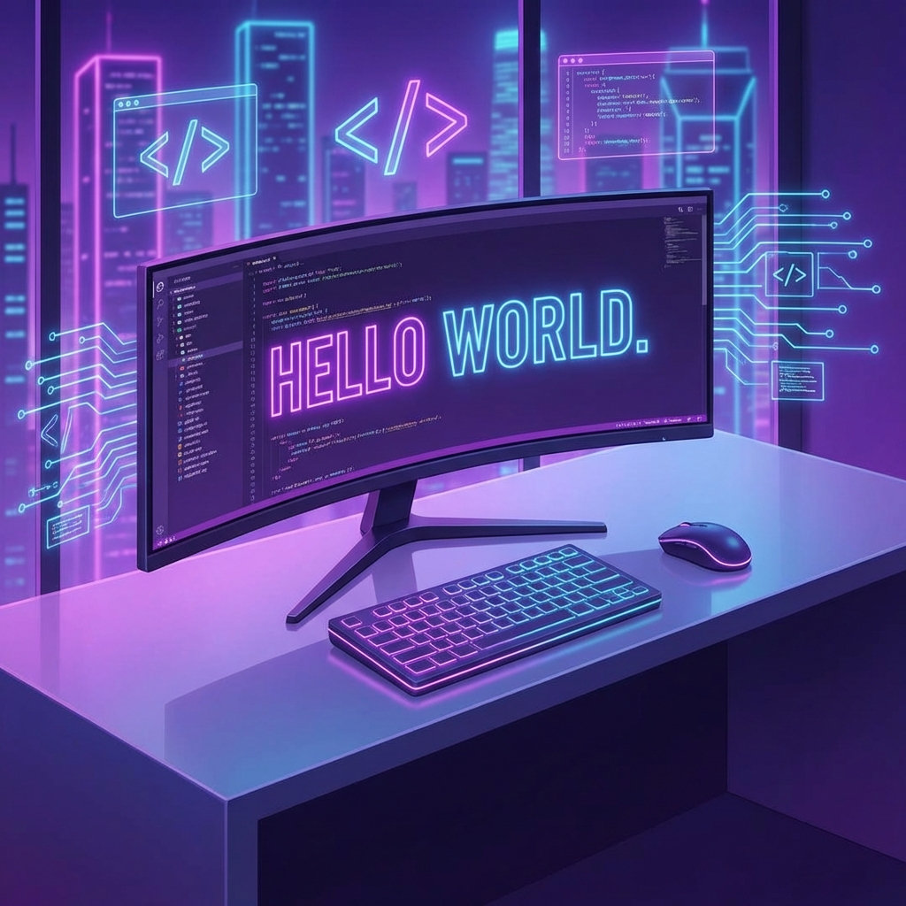

  

<h1 align="center">Olá, eu sou o Gabriel! 👋</h1>
<h3 align="center">Desenvolvedor Apaixonado por Automação e IA</h3>

  
  

---

### 🚀 Sobre Mim

Sou um desenvolvedor focado em criar soluções eficientes e bonitas. Adoro explorar novas tecnologias, especialmente no mundo da automação com n8n e Inteligência Artificial.

- 🔭 Atualmente trabalhando em **projetos de automação com IA**.
- 🌱 Aprendendo mais sobre **Deep Learning e Agentes Autônomos**.
- 💬 Pergunte-me sobre **n8n, Python, e automação de workflows**.
- 📫 Como me encontrar: **gabrielluizprf@gmail.com** ou [LinkedIn](https://www.linkedin.com/in/gbit-dev/)

---

### 🛠️ Tech Stack

**Linguagens** 

**Frontend & Mobile** 

**Automação & Ferramentas** 

---

### 📊 Estatísticas do GitHub

  

  

---

  <i>"A simplicidade é o último grau de sofisticação."</i>

