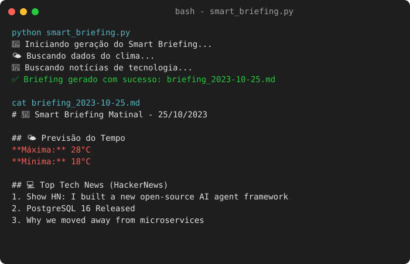

# ⚙️ Daily Smart Briefing




Um script elegante em Python focado em automação de rotina. Ele consome dados de múltiplas APIs (Clima + HackerNews) e compila um resumo matinal diário focado em tecnologia em formato Markdown.

## 🚀 Como funciona

O script executa os seguintes passos autonomamente:
1. Conecta-se à API pública do **Open-Meteo** para buscar a previsão de temperatura máxima e mínima do dia local.
2. Faz parsing das **Top 5 Notícias de Tecnologia** do dia via API oficial do **HackerNews**.
3. Processa e consolida tudo em um arquivo `briefing_YYYY-MM-DD.md`.

## 🛠️ Como executar

1. Instale as dependências:
   ```bash
   pip install -r requirements.txt
   ```
2. Execute o script principal:
   ```bash
   python smart_briefing.py
   ```
3. O script irá gerar automaticamente o arquivo na mesma pasta.

## 🧠 Lógica e Estrutura

- **Integração REST:** Utiliza a biblioteca `requests` para chamadas HTTP seguras com verificação de status (`raise_for_status()`).
- **Data Parsing:** Extração estruturada de JSON focado apenas nas chaves relevantes (title, url, temperature_2m).
- **Geração Dinâmica:** Geração de output em Markdown legível com interpolação de strings.

> *Dica: Este script pode ser atrelado a um cron job ou node no n8n para rodar toda manhã às 7h00 e enviar o arquivo via Telegram/Email.*
