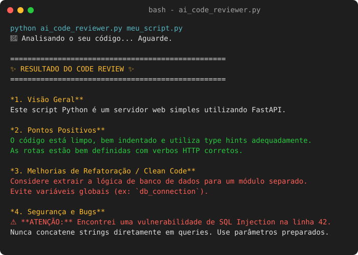

# 🤖 Micro AI Code Reviewer




Um agente inteligente de linha de comando (CLI) construído em Python que utiliza o modelo **Google Gemini 1.5 Pro** para atuar como um Engenheiro de Software Sênior. 

Você passa um arquivo de código para ele, e ele faz uma análise de Clean Code, segurança e possíveis refatorações em segundos!

## 🚀 Como funciona

O script faz a leitura de qualquer arquivo local (Python, JavaScript, etc.) e constrói dinamicamente um *prompt* para a inteligência artificial, injetando o seu código. O LLM então gera um relatório estruturado no terminal com:
- Resumo do que o código faz
- Pontos positivos
- Sugestões de Clean Code
- Verificação de Bugs ou riscos de Segurança

## 🛠️ Como executar

1. Instale as dependências:
   ```bash
   pip install -r requirements.txt
   ```
2. Crie um arquivo `.env` na mesma pasta (`ia/.env`) e adicione a sua chave de API do Gemini:
   ```env
   GEMINI_API_KEY=sua_chave_secreta_aqui
   ```
3. Execute o script passando o caminho de um arquivo para ser revisado:
   ```bash
   python ai_code_reviewer.py meu_script_para_revisar.py
   ```

## 🧠 Lógica e Estrutura

- **Prompt Engineering Avançado:** Instruções precisas ("Você é um Engenheiro de Software Sênior...") para garantir que a resposta seja rigorosa e útil.
- **Isolamento de Credenciais:** Uso de `python-dotenv` para evitar o vazamento de chaves de API no código-fonte.
- **Integração com SDK Oficial:** Chamadas robustas via biblioteca oficial do `google-generativeai`.

> *Dica: Este script pode ser expandido facilmente para ler múltiplos arquivos de uma vez ou ser integrado a um Hook do Git para revisar seu código automaticamente antes de cada commit!*
